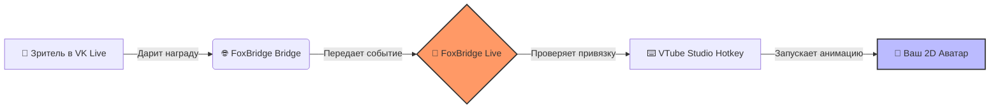

# 

# 
FoxBridge Live

  <b>Профессиональное связующее звено между вашей аудиторией в VK Live и миром VTube Studio.</b> 
  Автоматизируйте взаимодействие со зрителями и превратите каждый подарок в живую эмоцию вашего аватара.

  
  
  

  
  
  
  

---

## 🛠 Как это работает?

---

## ✨ Ключевые преимущества

### 🧠 Интеллектуальная обработка (FIFO)
Больше никакой путаницы и пропущенных наград. Система **Smart Queue** гарантирует, что все события будут выполнены по очереди. Каждая награда имеет свой независимый «поток», поэтому кулдаун одного триггера никогда не заблокирует выполнение других.

### 🔌 Бесшовная интеграция
FoxBridge Live автоматически обнаруживает запущенную **VTube Studio** и подключается к ней по локальному API. Список ваших хоткеев подгружается мгновенно — вам остается только выбрать нужный.

### 🛡 Безопасность прежде всего
*   **Локальное хранение**: Ваши данные и настройки хранятся только на вашем компьютере.
*   **Relay-авторизация**: Мы используем защищенный механизм передачи событий, чтобы ваши токены VK никогда не подвергались риску.

### 💎 Премиальный UX
*   **Сворачивание в трей**: Приложение работает тихо в фоне, не отвлекая от процесса стрима.
*   **Живой лог**: Наблюдайте за обработкой наград в реальном времени с детальной историей.
*   **Автоподключение**: Настройте один раз — и приложение будет само восстанавливать связь с VTS при каждом запуске.

---

## 🚀 Быстрый старт

1.  **Установка**: Скачайте и запустите установщик со страницы [Releases](https://github.com/yafoxins/FoxBridge_Live/releases).
2.  **VTube Studio**: Включите "Start API" в настройках (раздел Plugins).
3.  **Связь**: Войдите через VK и создайте привязки во вкладке "Триггеры".
4.  **Готово**: Наслаждайтесь новым уровнем взаимодействия с аудиторией!

---

## 👥 Команда проекта

| Роль | Профиль | Контакты |
| :--- | :--- | :--- |
| **Разработчик** | **YaFoxin Dev** |   |
| **Вдохновитель** | **Naynoira** |   |

---

## 🤝 Поддержка и обратная связь

Мы активно развиваем проект и прислушиваемся к сообществу.
*   🌐 Официальный портал: [vtubing.ru](https://vtubing.ru)
*   🐛 Нашли ошибку? [Создайте Issue](https://github.com/yafoxins/FoxBridge_Live/issues)
*   📢 Новости и обновления в нашем [Telegram-канале](https://t.me/yafoxindev)

---

## 📄 Лицензия

Проект распространяется под лицензией **MIT**. Полный текст в файле [LICENSE](LICENSE).

  <i>Сделано с ❤️ для стримеров нового поколения.</i>

